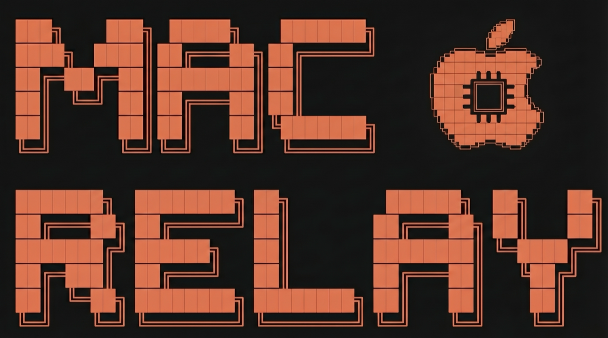

# MacRelay

<p align="center">
  
</p>

[](https://github.com/drbarq/macrelay/actions/workflows/ci.yml)


Open-source MCP server that relays your AI's commands to native macOS apps.

Local, privacy-first, open-source. Works with Claude Desktop, Cursor, Claude Code, and any MCP-compatible client. No cloud, no subscriptions, no telemetry.

---

**Built by [Joe Tustin](https://joetustin.com)**

[](https://www.linkedin.com/in/joetustin/)
[](https://www.tiktok.com/@joetustin_)
[](https://joetustin.substack.com/)
[](mailto:hello@joetustin.com)

## What It Does

MacRelay gives AI assistants direct access to your Mac's native apps:

- **Calendar** - Create events, search schedules, find available times
- **Reminders** - Create, complete, and manage reminders
- **Contacts** - Search and browse your contacts
- **Messages** - Search conversations, send iMessages
- **Mail** - Search, read, compose, reply, forward emails
- **Notes** - Search, read, create, and edit notes
- **Maps** - Search places, get directions, find nearby POIs
- **Location** - Get your current location
- **UI Automation** - Click buttons, fill forms, navigate menus in any app
- **Stickies** - List, read, create sticky notes
- **Shortcuts** - List and run Siri Shortcuts

Everything runs 100% locally on your Mac. No data leaves your machine.

## A Note from Joe

**TLDR: Claude + Mac Access = ????**

This project is extremely exciting to me — and I hope it is to you too. But I want to be upfront:

**You are giving AI access to everything you have access to.** Your calendar, your emails, your messages, your contacts, your notes, your files. It can click buttons, fill forms, and run shortcuts on your behalf. For some people, that's incredibly empowering. For others, it's terrifying. Both reactions are completely valid.

Use the `--service` flag to enable only the tools you're comfortable with. Start small. See how it feels.

I'd love to hear about the wonderful things you build with this. And I'd love to hear about it if it nukes your machine. Either way, reach out — [hello@joetustin.com](mailto:hello@joetustin.com).

## Quick Start

**Requirements:** macOS 14+ (Sonoma or later)

### Option A: Pre-built binary (no Rust needed)

```bash
mkdir -p ~/.local/bin && \
curl -L https://github.com/drbarq/macrelay/releases/download/v1.0.0/macrelay-macos-universal \
  -o ~/.local/bin/macrelay && chmod +x ~/.local/bin/macrelay
```

### Option B: Homebrew

```bash
brew install drbarq/tap/macrelay
```

### Option C: Build from source

```bash
git clone https://github.com/drbarq/macrelay.git && cd macrelay
bash scripts/setup-claude.sh
```

### Configure your MCP client

If you used Option A or B, add MacRelay to your MCP client config:

**Claude Desktop** (`~/Library/Application Support/Claude/claude_desktop_config.json`):
```json
{
  "mcpServers": {
    "macrelay": {
      "command": "~/.local/bin/macrelay"
    }
  }
}
```

**Claude Code** (`~/.claude/mcp.json`):
```json
{
  "mcpServers": {
    "macrelay": {
      "command": "~/.local/bin/macrelay"
    }
  }
}
```

Option C (build from source) auto-configures both clients via the setup script.

Then restart your MCP client and try: *"What's on my calendar this week?"*

## Current Status

**Feature complete.** 71 tools across 13 services.

| Metric | Value |
|---|---|
| Tools implemented | 71 |
| Tests written | 166 (137 CI-safe, 29 local-only) |
| Coverage | 13/13 services |
| CI Status | passing (GitHub Actions) |

| Service | # | Tools | Status |
|---|---|---|---|
| **Calendar** | 8 | list_calendars, search_events, create_event, reschedule_event, cancel_event, update_event, open_event, find_available_times | Done |
| **Reminders** | 7 | list_lists, search_reminders, create_reminder, update_reminder, delete_reminder, complete_reminder, open_reminder | Done |
| **Contacts** | 2 | search, get_all | Done |
| **Permissions** | 1 | permissions_status | Done |
| **Notes** | 8 | list_accounts, list_folders, search_notes, read_note, write_note, delete_note, restore_note, open_note | Done |
| **Mail** | 13 | list_accounts, list_mailboxes, search_messages, get_messages, get_thread, compose_message, reply_message, forward_message, update_read_state, move_message, delete_message, open_message, get_attachment | Done |
| **Messages** | 4 | search_chats, get_chat, search_messages, send_message | Done |
| **Location** | 1 | get_current | Done |
| **Maps** | 4 | search_places, get_directions, explore_places, calculate_eta | Done |
| **UI Viewer** | 6 | list_apps, get_frontmost, get_ui_tree, get_visible_text, find_elements, capture_snapshot | Done |
| **UI Controller** | 10 | click, type_text, press_key, scroll, drag, select_menu, manage_window, manage_app, file_dialog, dock | Done |
| **Stickies** | 4 | list, read, create, open | Done |
| **Shortcuts** | 3 | list, get, run | Done |

## How It Was Built

Built in a single Claude Code session:

| Metric | Value |
|---|---|
| Model | Claude Opus 4.6 (1M context) |
| Context used | 318k tokens |
| Total tokens | 113M (845k in, 283k out, 112.7M cached) |
| Throughput | 103 tokens/sec (4.7 in, 98.6 out) |
| Tools implemented | 71 |
| Tests written | 166 |
| Lines of Rust | ~8,000 |

## Architecture

### Tech Stack

| Component | Technology | Why |
|---|---|---|
| Language | Rust (edition 2024) | Performance, safety, native macOS FFI |
| MCP Server | rmcp 1.4 | Mature MCP implementation |
| macOS APIs | AppleScript/JXA + SQLite | Reliable cross-app automation |
| Database | rusqlite (bundled) | Read Messages chat.db directly |
| UI Automation | System Events + JXA | Accessibility tree inspection + input simulation |

### Project Structure

```
macrelay/
  Cargo.toml                        # Workspace root
  crates/
    macrelay-server/                # MCP server binary (macrelay)
      src/main.rs                   # Entry point, ServerHandler impl
    macrelay-core/                  # Core library
      src/
        registry.rs                 # Service registry, tool routing
        permissions.rs              # Permission checking
        services/
          calendar/                 # 8 tools - AppleScript
          reminders/                # 7 tools - AppleScript
          contacts/                 # 2 tools - AppleScript
          notes/                    # 8 tools - AppleScript
          mail/                     # 13 tools - AppleScript
          messages/                 # 4 tools - SQLite + AppleScript
          location/                 # 1 tool - CoreLocation via Swift
          maps/                     # 4 tools - Maps URL scheme
          ui_viewer/                # 6 tools - System Events + JXA
          ui_controller/            # 10 tools - System Events
          stickies/                 # 4 tools - RTFD files + JXA
          shortcuts/                # 3 tools - /usr/bin/shortcuts
          permissions_status.rs     # 1 tool
        macos/
          applescript.rs            # osascript/JXA runner (with mocking)
          eventkit.rs               # EventKit helpers
  scripts/
    setup-claude.sh                 # Build + install + configure
  docs/
    PRD.md                          # Full product requirements
    TESTING.md                      # Comprehensive testing strategy
```

## Security

MacRelay is designed with security as a core principle:

- **100% local** — No data leaves your machine. No cloud, no telemetry, no analytics.
- **Injection-safe** — All user input is escaped via dedicated helpers (`escape_applescript_string`, `escape_jxa_string`, `escape_shell_single_quoted`) before embedding in AppleScript/JXA/shell commands. No raw string interpolation.
- **Read-only databases** — SQLite connections (Messages, Notes, Mail) are opened with `SQLITE_OPEN_READ_ONLY`. All queries use parameterized bindings, never string concatenation.
- **No dependencies with known vulnerabilities** — `cargo audit` reports zero advisories across 151 crate dependencies.
- **Minimal permissions** — Each tool requests only the macOS permissions it needs. The `permissions_status` tool lets you audit all states.
- **Open source** — Every line is auditable. See [SECURITY_REPORT.md](SECURITY_REPORT.md) for the full security audit.

## Permissions

MacRelay uses AppleScript to interact with native apps. macOS will prompt for Automation permission per-app on first use.

| Permission | Required For | How It's Granted |
|---|---|---|
| Automation (per app) | Calendar, Reminders, Contacts, Mail, Notes, Messages, Stickies | Prompted automatically |
| Accessibility | UI Viewer + UI Controller tools | System Settings > Privacy & Security > Accessibility |
| Full Disk Access | Messages search (SQLite) | System Settings > Privacy & Security > Full Disk Access |
| Location Services | Location tool | Prompted automatically |

Use the `permissions_status` tool to check all states at once.

## Testing

MacRelay uses a three-tier testing strategy (see [docs/TESTING.md](docs/TESTING.md) for the full strategy, audit, and per-service coverage report).

```bash
# Run 137 CI-safe unit and mock-based tests (Tier 1 & 2), ~10s, no permissions
cargo test -p macrelay-core --lib

# Run all 166 tests including 29 local-only tests that hit real macOS apps (Tier 3)
# WARNING: This will interact with your real Calendar/Notes/Mail/Reminders/Contacts.
cargo test -p macrelay-core --all-targets -- --include-ignored
```

| Tier | What it validates | Count | Runs in CI? |
|---|---|---:|:---:|
| **Tier 1** — Pure unit | Schemas, registration, helper functions (escape, key codes, date math) | ~20 | ✓ |
| **Tier 2** — Script-inspecting mocks | Every tool's generated AppleScript/JXA fragment + response parsing + error paths + required-param validation | ~117 | ✓ |
| **Tier 3** — Real-app round-trips | End-to-end against real Calendar/Reminders/Notes/Mail/Contacts/Messages | 29 (`#[ignore]`d) | ✗ (maintainer's Mac only) |

The CI workflow on every push/PR runs `cargo fmt --check`, `cargo clippy -- -D warnings`, and `cargo test -p macrelay-core --lib` on `macos-latest`. All three gates must pass.

## Roadmap

### Completed
- [x] Phase 1: Calendar + Reminders + Contacts (18 tools)
- [x] Phase 2: Notes + Mail + Messages + Location + Maps (30 tools)
- [x] Phase 3: UI Viewer + UI Controller (16 tools)
- [x] Phase 4: Stickies + Shortcuts (7 tools)
- [x] Phase 5: Testing refinement (166 tests: 137 CI-safe, 29 local-only Tier 3 round-trips)
- [x] Phase 6: GitHub Actions CI (fmt + clippy + tests on `macos-latest`)

### Future

- [ ] **System Control** - Volume, brightness, Wi-Fi, battery, DND
- [ ] **Safari/Browser** - Bookmarks, history, reading list, open tabs
- [ ] **Music** - Playback control, search library, queue management
- [ ] **Photos** - Search photos, browse albums, get metadata
- [ ] **Clipboard** - Read/write clipboard contents
- [ ] **Notifications** - Send macOS notifications
- [ ] **Finder** - Advanced file operations, tags, Spotlight search
- [ ] **Terminal** - Execute shell commands (sandboxed)

### Future: Distribution
- [x] Homebrew formula (`brew install drbarq/tap/macrelay`)
- [x] GitHub Actions — universal binary releases on tag push
- [ ] System tray app (Tauri) with status indicator
- [ ] DMG installer + code signing for non-technical users

## Suggest Improvements

Got an idea for a new tool, service, or feature? [Open an issue](https://github.com/drbarq/macrelay/issues/new?labels=product+improvement&title=Suggestion:+) with the **product improvement** label and tell me what you'd like to see. I read every one.

## Contributing

Want to build it yourself? PRs are welcome. Adding a new service is self-contained:
1. Create a module in `crates/macrelay-core/src/services/`
2. Implement tools following the pattern in `calendar/mod.rs`
3. Register in `services/mod.rs` and `macrelay-server/src/main.rs`
4. Add tests (Tier 1 and Tier 2)

All PRs require review approval and CI passing before merge. See [docs/PRD.md](docs/PRD.md) for the full product requirements and technical details.

## License

MIT
